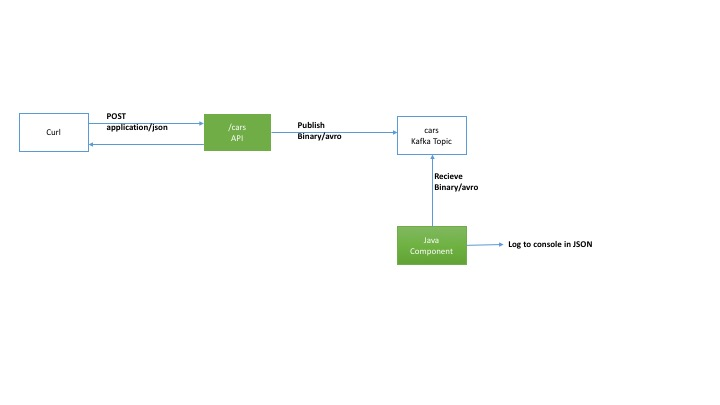

# Spring Cloud Stream, Spring Rest, Kafka, Avro Demo

##Objectives
* **Demonstrate microservices connected via Kafka**

* **Demonstrate schema evolution via AVRO**

* **Demonstrate bi-directional messages from websockets to kafka and vice-versa**

The app exposes a `/cars` REST endpoint capable of receiving a JSON message via HTTP POST. Below example, shows POST via curl and the car schema

`curl -i -H "Content-Type: application/json" -X POST -d '{"year":"2014","make":"toyota19","model":"something cool","engine":"2.67"}' http://localhost:8080/cars`
 
The REST endpoint in turn publishes the AVRO version of that message to the kafka topic called "avroautos".
Another service, picks up the AVRO message and logs it to the console in JSON format. 

Avro was chosen primarily due to schema evolution features.

To demonstrate bi-directional messages from websockets, a user-agent sends carIDs(aka activity event) that it would like to track via websockets to a destination "/app/activity" and the user-agent subscribes to a topic called "/topic/tracker". On server side, the server timestamp is added to every activity event and message is routed to a kafka topic called "cartracker". Then a java component subscribes to the "cartracker" topic and dispatches the event to SimpleMessageRouter,which in turn broadcasts the message to all subscribed user-agents.

To access UI for websockets: 

* Direct your browser to `http://localhost:8080/index.html`
* Press connect
* Send car identifier
* Browser displays the message from kafka

The websockets endpoint for protocol upgrade is `/websocket`

To compile the application, cd to the application root folder and issue : `./gradlew build`

To run the application: 
* **If you are not running docker version, first start zookeeper and kafka. Then run the application via command `java -jar build/libs/demo-0.0.1-SNAPSHOT.jar`**

* **If you are running via docker, simply issue: `docker-compose up --build`. This will start one container for zookeeper, other for kafka and yet another for demo application.**

* **To view docker images: `docker images`**

* **To view docker containers: `docker ps -a`**

* **You can run each docker image as standalone and get access to bash shell to view environment variables. Another way to view environment variables for running containers is through the command `docker inspect --format '{{ .Config.Env }}'`**
